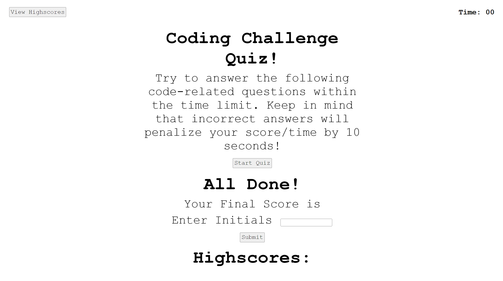

# Web APIs Web Quiz

## Description
For this week's challenge, we had to create a quiz on the web.

## Usage
Press the start quiz button and the quiz will start. The timer will also start. At the end of the quiz, it will show your score and you can submit your initials. You can also view your scores from the top left and it will save from the previous time you've played. 

## Links
My GitHub Repository: https://github.com/PechMV/web-apis-code-quiz

Deployed URL for Web Application: https://pechmv.github.io/web-apis-code-quiz/